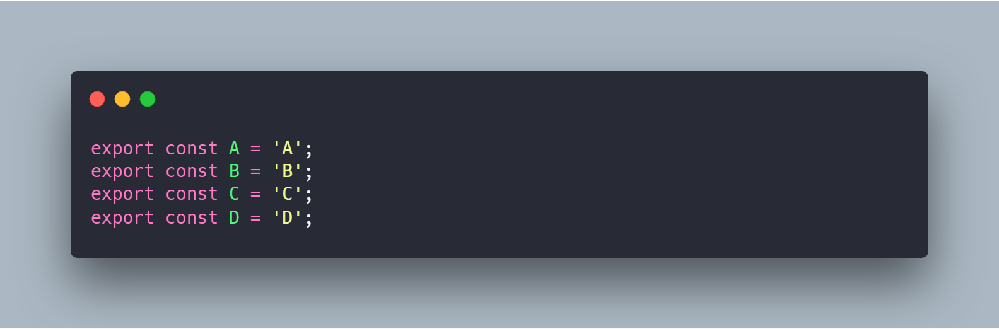
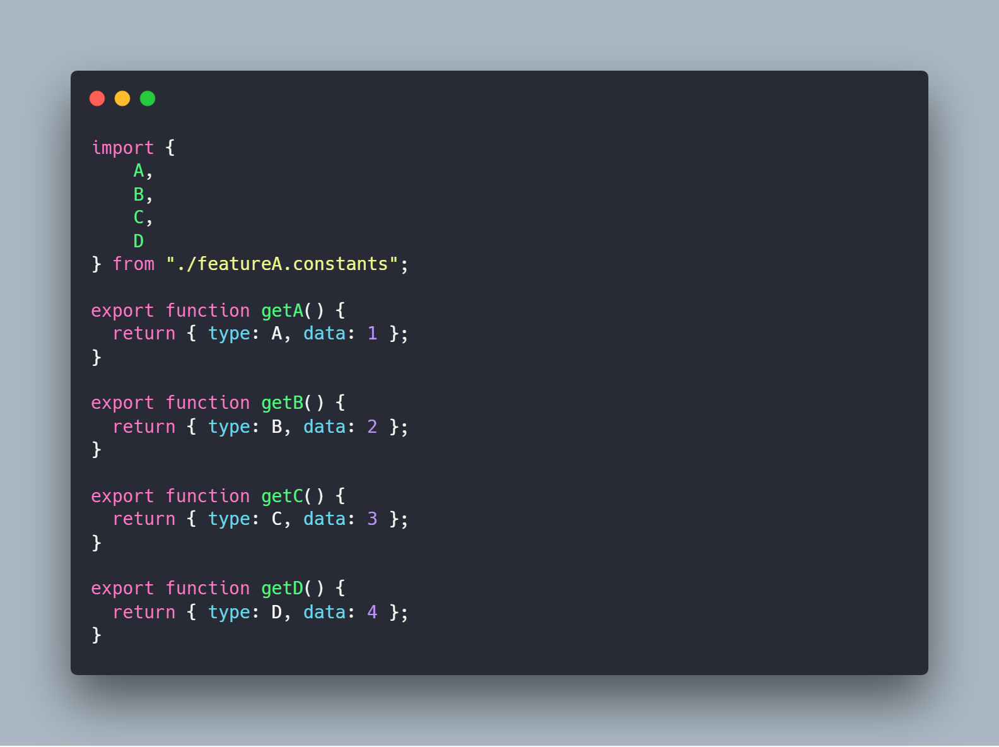
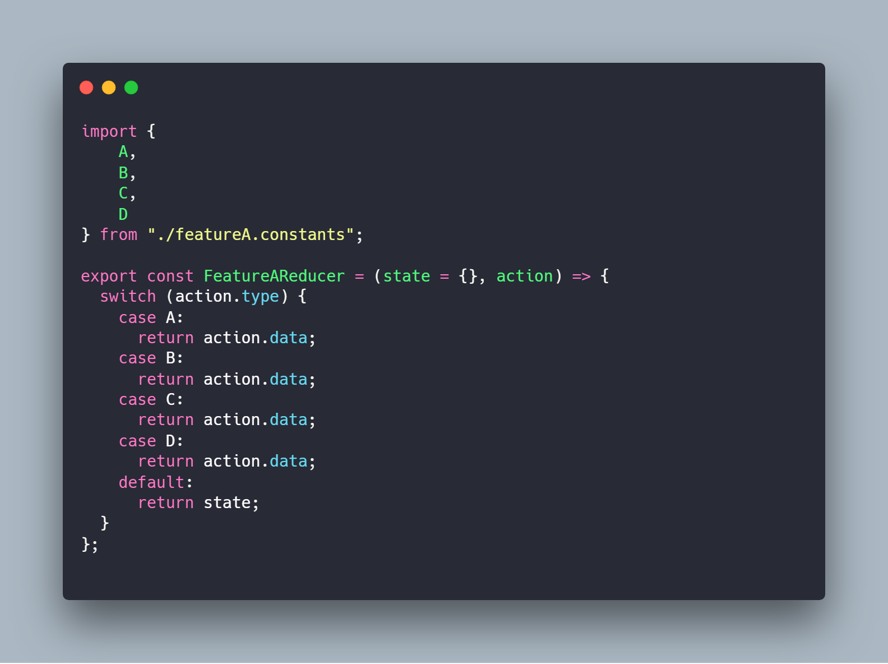
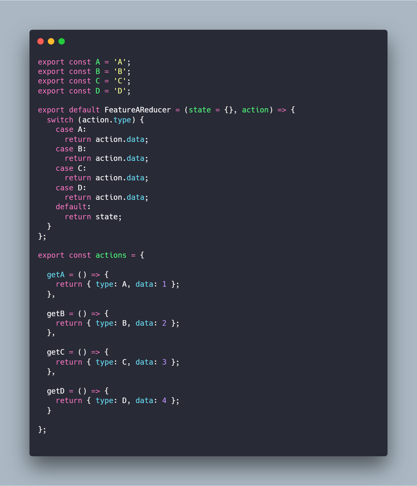
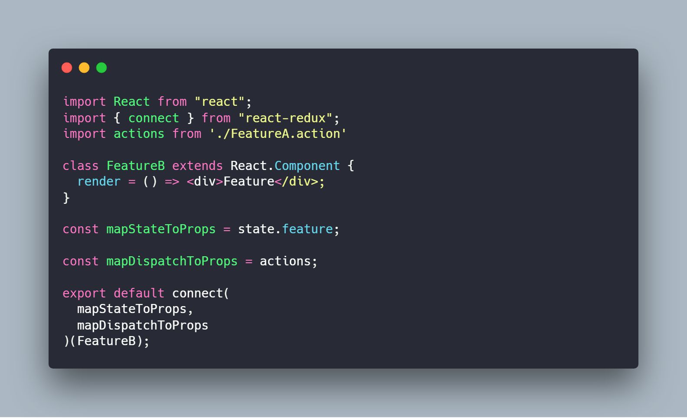
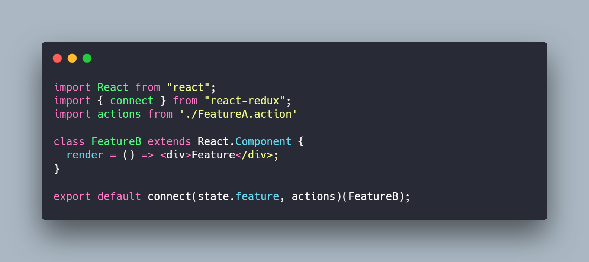
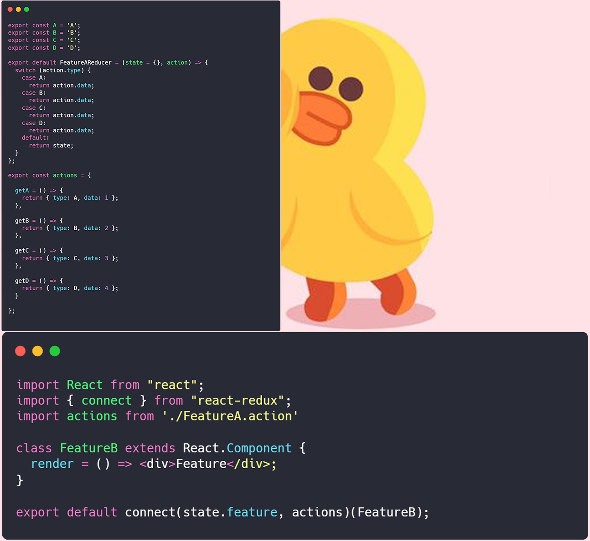

# Improve coding experience

### Scaling Redux App with ducks

How does your front-end application scale? How do you make sure that the code you’re writing is maintainable 6 months from now?

When you learn about redux and the roles of actions and reducers, you start with very simple examples. Most tutorials available today don’t go to the next level. But if you’re building something with Redux that’s more complicated than a todo list, you’ll need a smarter way of scaling your codebase over time.

Someone once said that naming things is one of the hardest jobs in computer science. I couldn’t agree more. But structuring folders and organizing files is a close second.

Let’s explore how we approached code organization in the past.

# Function vs Feature

There are two established approaches of structuring applications: function-first and feature-first.

One the left below you can see a function-first folder structure. On the right you can see a feature-first approach.

Function-first means that your top-level directories are named after the purpose of the files inside. So you have: containers, components, actions, reducers, etc.

This doesn’t scale at all. As your app grows and you add more features, you add files into the same folders. So you end up with having to scroll inside a single folder to find your file.

The problem is also about coupling the folders together. A single flow through your app will probably require files from all folders.

One advantage of this approach is that it isolates — in our case — React from redux. So if you want to change the state management library, you know which folders you need to touch. If you change the view library, you can keep your redux folders intact.

Feature-first means that the top-level directories are named after the main features of the app: product, cart, session.

This approach scales much better, because each new feature comes with a new folder. But, you have no separation between the React components and redux. Changing one of them on the long run is a very tricky job.

Additionally you have files that do not belong to any feature. You end up with a folder common or shared, because you want to reuse code across many features in your app.

This approach scales much better, because each new feature comes with a new folder. But, you have no separation between the React components and redux. Changing one of them on the long run is a very tricky job.

Additionally you have files that do not belong to any feature. You end up with a folder common or shared, because you want to reuse code across many features in your app.

# The best of two worlds

single idea: always separate State Management files from UI files.

Our approach starts from the need to isolate the React code into a single folder — called views — and the redux code into a separate folder — called redux.

# Enter re-ducks

Each feature of the application should map to separate actions and reducers, so it makes sense to go for a feature-first approach.

The original ducks modular approach is a nice simplification for redux and offers a structured way of adding each new feature in your app.

Yet, we wanted to explore a bit what happens when the app scales. We realized that a single file for a feature becomes too cluttered and hard to maintain on the long run.

Every time a new function is added to a project previously written with redux, it will be added from actionTypes, actions and reducer file by file. If you are not careful, you will make mistakes.

Every time a new function is added, { {actionTypes, actions, reducer} } pairs need to be added to a separate file. Therefore, it is better to combine them into a separate module.

This is how re-ducks was born. The solution was to split each feature into a duck folder.

> constant

> action

> reducer

> reducer

There are many referenced codes that can be omitted:

Import constants are not required in the action file, 

Import constants are not required in the reducer file,

> react

Before:

After:

more after:

Import constants are not required in the action file,

Import single action are not required in the react file.

The migration to this code structure was painless, and I foresee it reducing much future development misery.

# Q&A

# THANKS

https://medium.freecodecamp.org/scaling-your-redux-app-with-ducks-6115955638be

https://github.com/erikras/ducks-modular-redux

https://www.robinwieruch.de/the-soundcloud-client-in-react-redux-ducks/

https://medium.com/swlh/the-good-the-bad-of-react-redux-and-why-ducks-might-be-the-solution-1567d5bdc698

https://medium.com/building-crowdriff/react-redux-file-architecture-ducks-it-up-6b32eaaba341